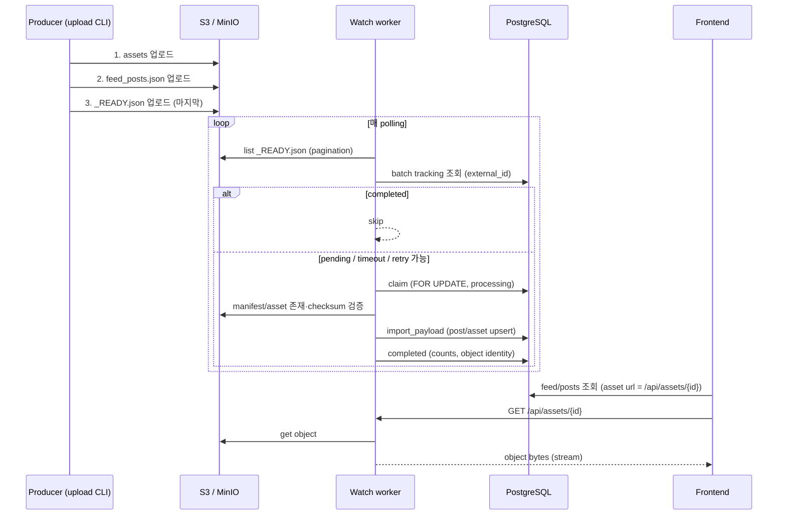
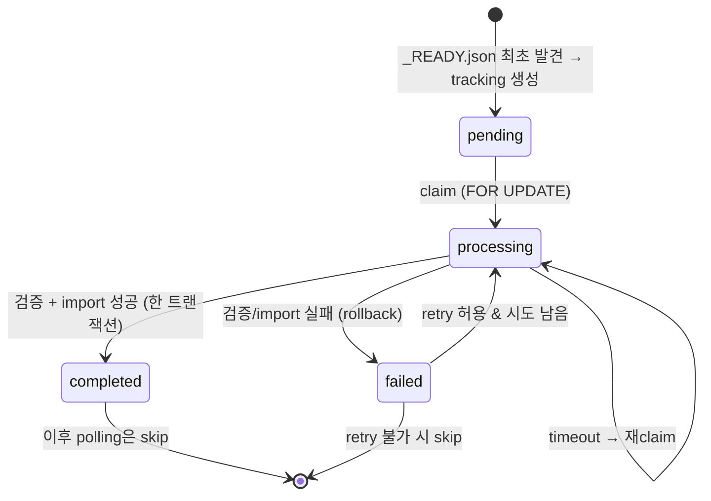

# S3/MinIO Ingestion Architecture (v1.2.x)

외부 분석/생성 프로그램이 배치를 S3-compatible object storage(집: MinIO / 회사:
S3)에 올리면, Estagram backend가 이를 발견해 기존 import 파이프라인으로 DB에
반영하는 ingestion의 전체 그림입니다. 기존 로컬 filesystem ingestion(v0.3.x)은
그대로 유지되고, S3는 두 번째 discovery backend로 나란히 동작합니다.

## 핵심 원칙

- **Immutable object source** — S3/MinIO에 올라간 객체는 원본 그대로 둡니다.
  rename / move / prefix 이동 / copy-후-delete / import 후 삭제 / 실패 후 이동 —
  **어떤 것도 하지 않습니다.** 런타임 storage 계층(`S3ObjectStore`)에는 쓰기/삭제
  메서드 자체가 없습니다(업로드는 producer 전용 CLI만 수행).
- **PostgreSQL이 상태의 source of truth** — 배치 처리 상태는 객체 이름/위치가
  아니라 `import_batch.ingest_state`(pending/processing/completed/failed/ignored)로
  관리합니다. 같은 배치가 매 polling마다 발견되는 것은 정상입니다.
- **`_READY.json`은 완료 신호** — "이 배치의 manifest와 모든 asset 업로드가 끝났으니
  읽어도 된다"는 의미일 뿐, 상태 저장소가 아닙니다. 처리 후에도 이동/삭제하지
  않습니다.
- **import 로직 재사용** — 검증/DB 생성은 복제하지 않고 기존 `import_payload`를
  씁니다. filesystem·HTTP·S3가 같은 importer를 공유합니다.

## Object 레이아웃

```text
{S3_ROOT_PREFIX}/
└─ {S3_BATCHES_PREFIX}/            # 기본 batches
   └─ {batch_external_id}/
      ├─ feed_posts.json          # manifest (동결된 external package format)
      ├─ assets/
      │  └─ image_001.png         # manifest가 "assets/image_001.png"로 참조
      └─ _READY.json              # 가장 마지막에 업로드
```

## 구성 요소 (코드)

| 역할 | 위치 |
|---|---|
| 읽기 전용 object store (boto3) | `app/services/s3_storage.py` (`S3ObjectStore`, `S3IngestConfig`) |
| `_READY.json` 스키마·검증 | `app/schemas/s3_ready.py` |
| 배치 발견 + 검증 | `app/services/s3_discovery.py` |
| tracking + claim + import | `app/services/s3_ingest.py` (`process_batch`, `decide_action`, `claim_batch`) |
| watch worker + CLI | `app/services/process_s3_incoming.py` |
| producer 업로드 CLI | `scripts/upload_post_batch.py` |
| asset 서빙 proxy | `app/api/routes/assets.py` + `app/services/asset_url.py` |
| tracking 컬럼 | `app/models/import_batch.py` (migration 0013) |
| asset object identity | `app/models/asset.py` (migration 0013) |

## Sequence



S3 객체는 이 과정에서 **변경되지 않습니다.**

## State 전이



## Idempotency & 동시성

- 배치: `import_batch.external_id` unique → 중복 pending 방지. `SELECT … FOR UPDATE`
  claim → 두 worker가 동시에 같은 배치를 발견해도 하나만 처리.
- post/asset: 기존 `external_id` unique upsert(`import_payload`) 재사용.
- import + completed 표시는 **한 트랜잭션** → post만 생기고 asset이 빠지는 부분
  상태가 남지 않음. asset binary는 DB에 넣지 않고 S3에 두며, DB에는 존재/identity만.

## Asset URL 정책 (v1.2.4)

- DB에는 만료되지 않는 **object identity**만 저장(`storage_backend/bucket/object_key/
  size_bytes/etag`). presigned URL을 영구 저장하지 않음.
- 응답 직렬화 시 S3 자산의 url을 **절대 proxy URL**(`{ASSET_PROXY_BASE_URL}/api/
  assets/{id}`)로 변환(`app/services/asset_url.py`).
- `GET /api/assets/{id}`가 S3에서 객체를 스트리밍(private bucket 지원, presigned
  만료 무관, frontend 변경 없음). 기존 로컬/원격 url 자산은 그대로 둠.

## 환경 분리

동일 boto3 코드·동일 애플리케이션. 환경 차이는 환경변수뿐입니다.

- 집: `S3_ENDPOINT_URL=http://localhost:9000`, `S3_FORCE_PATH_STYLE=true` (MinIO)
- 회사: 실제 S3 endpoint(또는 S3-compatible endpoint), `S3_FORCE_PATH_STYLE=false`

## 보안

- secret은 `.env`에만(gitignore), 로그/`repr`에 노출 안 함(`SecretStr`).
- manifest asset은 batch-relative 경로만 허용(`../`/절대/`s3://`/`http://` 차단).
  외부 URL fetch 없음.
- S3 pagination 필수, path traversal 차단, malformed JSON 처리, 지정 prefix
  최소권한 권장.
```
